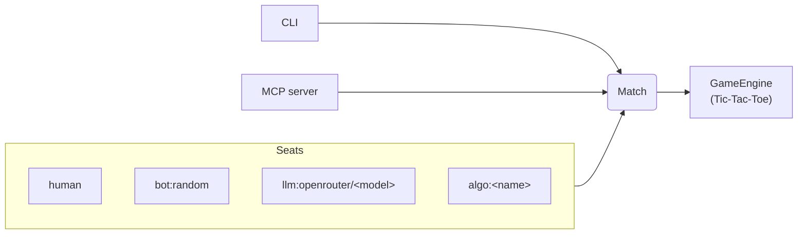

# agent-game-framework

An installable Python framework for playing turn-based/simultaneous-move games with any mix
of human- and AI-controlled seats — including zero-human, fully autonomous matches. Ships
one reference game (Tic-Tac-Toe) plus a CLI and an MCP connector, so an agent harness (or a
human) can drive a match identically.



Any seat is `human`, `bot:random`, an LLM (`llm:openrouter/<model>`), or a standalone game
algorithm composed with an LLM — either LLM-advised or algorithm-autoplay-narrated. A human
seat can also freely chat with an LLM-backed opponent at any time, decoupled from making
moves. See `docs/PLAN.md` and `docs/adr/` for the full design.

**Status:** V1 (core engine, CLI, human/bot seats), V2 (MCP connector), V3 (LLM seat
controller with in-character banter, via OpenRouter), V4 (standalone game algorithms,
composable with an LLM seat), and V5 (freeform chat with an LLM seat, independent of its
own moves) are all complete — see `AGENTS.md` for the day-to-day build/test commands and
per-slice detail.

## Quick start

```
uv sync --all-extras --dev
cp .env.example .env   # then set OPENROUTER_API_KEY -- see Configuration below
make demo               # play tic-tac-toe vs. unbeatable minimax, narrated + chattable via an LLM
```

`make play` plays the same game against a random bot instead, with no API key needed;
`make demo-advised` plays against an LLM that decides its own moves (informed by minimax's
recommendation, but can still lose). Run a bare `make` (or `make help`) to see every
available command.

## Usage

Play from the CLI, human vs. a random bot:

```
agf play tictactoe --seat X=human --seat O=bot:random
```

Play against an LLM seat directly (needs `OPENROUTER_API_KEY`, see Configuration):

```
agf play tictactoe --seat X=human --seat O=llm:openrouter/openai/gpt-4o-mini
```

Zero human seats works identically — it's just a different seat map:

```
agf play tictactoe --seat X=bot:random --seat O=bot:random
```

Add `--json` to any `play` invocation to emit one JSON line per turn instead of a rendered
board (scriptable/diffable output).

An algorithm (e.g. `TicTacToeMinimaxAlgorithm`) can compose with an LLM seat two ways: the
LLM decides but sees the algorithm's recommendation each turn, or the algorithm decides
every move and the LLM only narrates/banters about what it did:

```
agf play tictactoe \
  --seat X=llm:openrouter/openai/gpt-4o-mini:advised-by=algo:tictactoe-minimax \
  --seat O=algo:tictactoe-minimax:narrated-by=llm:openrouter/openai/gpt-4o-mini
```

Whenever the opposing seat is (or wraps) an LLM, a human seat can also chat with it —
`make demo` wires this up automatically. On your own turn, prefix a message with `chat: ` to
talk instead of moving; any other time (while it's the LLM's turn to move, even mid-decision)
just type freely — no prefix needed, since there's nothing else the line could mean.

An agent can instead drive a match over MCP (stdio transport) — one seat is controlled by
whichever MCP client calls `submit_action` for it, the other can be auto-played by a bot so
a full game completes without a second client:

```
python -m agent_game_framework.connectors.mcp.server
```

## Configuration

`OPENROUTER_API_KEY` is the only setting needed, required by any `llm:openrouter/<model>`
seat. Copy `.env.example` to `.env` and set it there (`.env` is gitignored) — `make demo`
loads it automatically; `agf` invoked directly picks it up from your shell environment.
`<model>` is any OpenRouter model slug, e.g. `openai/gpt-4o-mini` or
`anthropic/claude-3.5-sonnet`.

## Contributing

See `AGENTS.md` for the day-to-day workflow (branch/PR conventions, local checks, ADR
process).

## License

Apache License 2.0 — see `LICENSE`.
